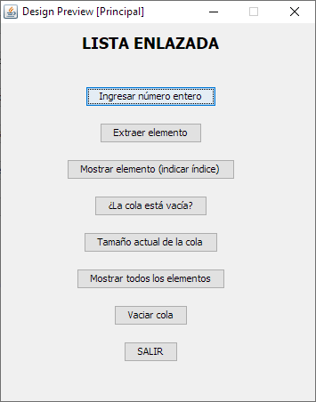
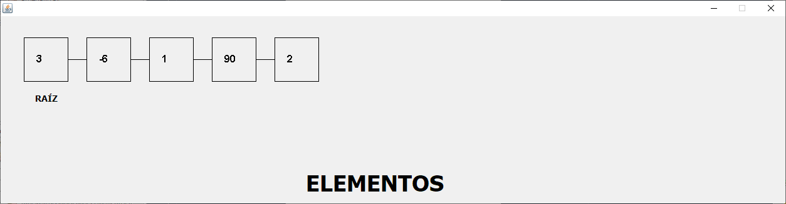

# Lista enlazada mediante 

Este proyecto crea una cola utilizando una lista enlazada, es decir, con nodos donde cada uno
tiene un elemento con la información y otro con un puntero al siguiente elemento. La
información de cada elemento es un número entero positivo o negativo.

El programa cuenta con las siguientes opciones:

1. Insertar elemento en la cola.
2. Extraer un elemento de la cola. En este caso, se muestra el número y se elimina.
3. Obtener el elemento de la cola en la posición que indique el usuario. Se muestra su
   valor, sin extraerlo.
4. ¿La cola está vacía?. En esta opción solo se indica SI o NO.
5. Tamaño actual de la cola. Para esto es necesario contar el número de elementos en la
   cola o de nodos en la lista enlazada.
6. Mostrar todos los elementos de la cola. Desde el primer elemento hasta el último (se muestra gráficamente).
7. Vaciar la cola, es decir, eliminar todos los nodos.
8. Terminar.  

## Consideraciones

* Creado mediante el lenguaje de programación Java
* JDK 8
* Netbeans 8.2
* Windows 10

## Capturas

**Gráfico**

